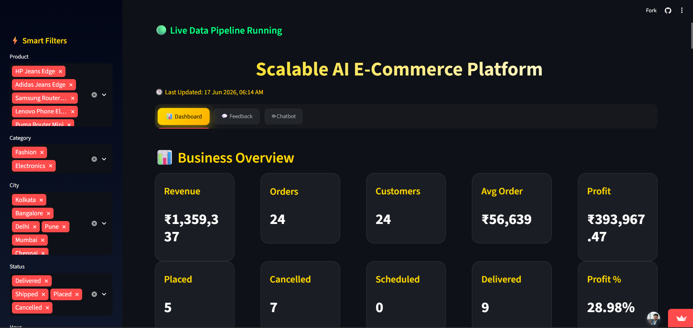
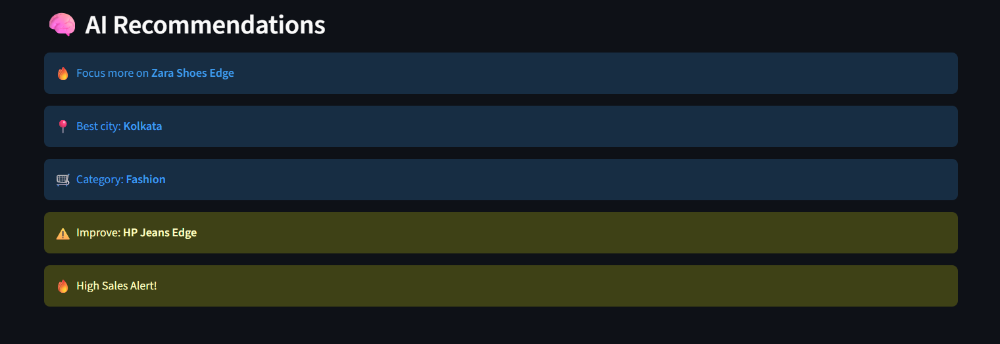
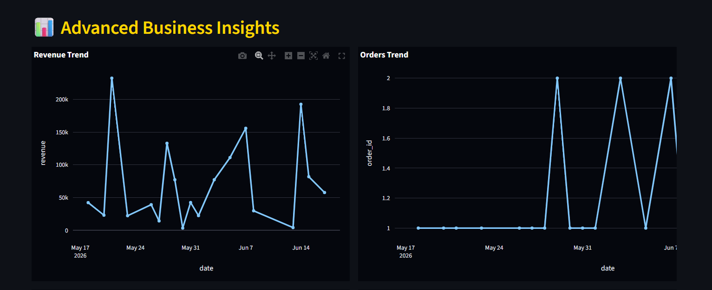
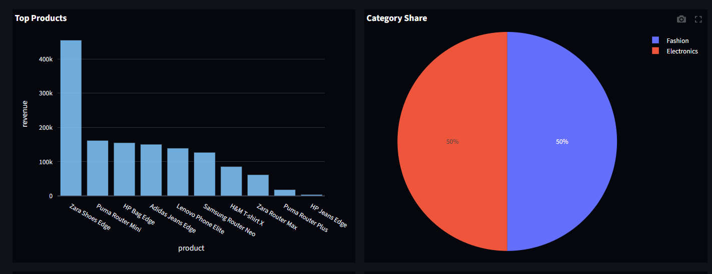
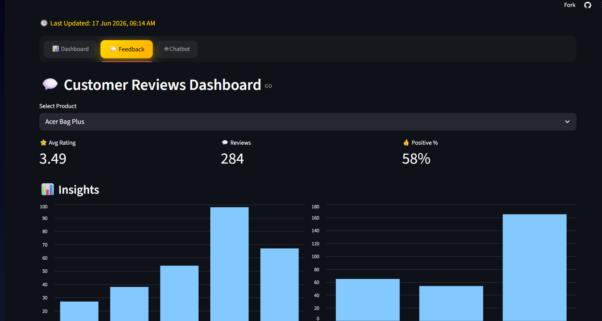
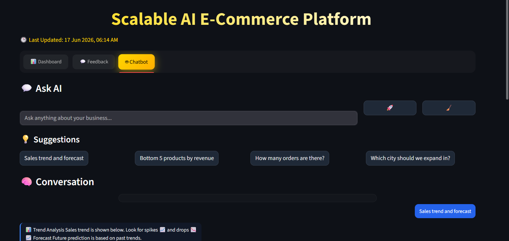
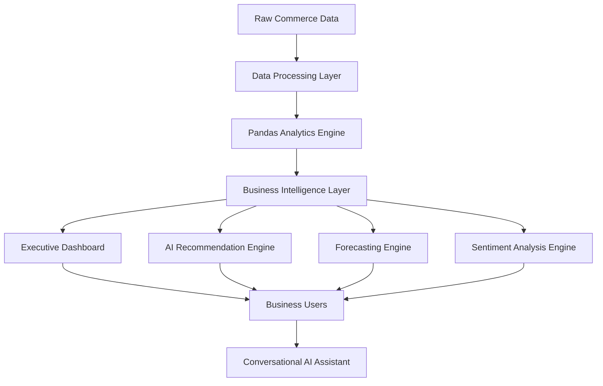

<p align="center">
  
</p>

<h1 align="center">🚀 Scalable AI E-Commerce Platform</h1>

<h3 align="center">
Real-Time Analytics • AI Recommendations • Forecasting • Sentiment Analysis • Conversational BI
</h3>

<p align="center">
  
  
  
  
  
  
</p>

<p align="center">
  
  
  
  
</p>

---

# 📖 Overview

Scalable AI E-Commerce Platform is an end-to-end Business Intelligence and Analytics solution designed to transform raw commerce data into actionable insights through real-time dashboards, predictive analytics, recommendation systems, customer intelligence, and conversational AI.

The platform provides business leaders, analysts, and decision-makers with a centralized environment for monitoring performance, forecasting growth, understanding customer behavior, and discovering revenue opportunities through AI-powered analytics.

---

# ✨ Core Features

## 📊 Real-Time Business Analytics

- Revenue Monitoring
- Profit Analysis
- Order Tracking
- Customer Insights
- KPI Dashboard
- Performance Monitoring

## 🧠 AI Recommendation Engine

- Product Optimization Suggestions
- Revenue Growth Opportunities
- Category-Level Recommendations
- Expansion Insights
- Business Performance Alerts

## 📈 Predictive Analytics

- Revenue Forecasting
- Sales Trend Analysis
- Future Growth Prediction
- Business Planning Support

## 💬 Conversational AI

- Natural Language Queries
- Business Intelligence Chatbot
- Interactive Data Exploration
- AI-Powered Insights

## 😊 Customer Intelligence

- Review Analytics
- Sentiment Analysis
- Product Satisfaction Monitoring
- Customer Feedback Insights

## 🎯 Smart Analytics

- Product-Level Analysis
- Category Analysis
- City-Wise Insights
- Order Status Monitoring
- Performance Comparisons

---

# 🖼️ Platform Preview

## Executive Dashboard

<p align="center">
  
</p>

---

## AI Recommendation Engine

<p align="center">
  
</p>

---

## Advanced Business Analytics

<p align="center">
  
</p>

---

## Product & Category Performance

<p align="center">
  
</p>

---

## Customer Intelligence Dashboard

<p align="center">
  
</p>

---

## Conversational AI Assistant

<p align="center">
  
</p>

---

# 🏗️ System Architecture



# ⚙️ Technology Stack

| Category | Technologies |
|-----------|-------------|
| Programming | Python |
| Analytics | Pandas, NumPy |
| Visualization | Plotly |
| Application Framework | Streamlit |
| Artificial Intelligence | OpenAI API |
| NLP | TextBlob |
| Forecasting | Statsmodels, ARIMA |
| Version Control | Git, GitHub |

---

# 📊 Intelligence Modules

| Module | Purpose |
|----------|------------|
| Executive Dashboard | Real-Time KPI Monitoring |
| Recommendation Engine | AI-Powered Business Suggestions |
| Forecasting Engine | Revenue Prediction & Trend Analysis |
| Sentiment Analyzer | Customer Review Intelligence |
| Analytics Hub | Product & Category Insights |
| Conversational AI | Natural Language Business Queries |

---

# 🚀 Key Business Insights

The platform enables organizations to:

- Monitor business performance in real time
- Identify top-performing products and categories
- Analyze customer sentiment and satisfaction
- Forecast future revenue trends
- Discover growth opportunities using AI recommendations
- Interact with business data using natural language

---

# 📂 Project Structure

```text
Scalable-AI-E-Commerce-Platform
│
├── dashboard.py
├── chatbot.py
├── forecasting.py
├── recommendation_engine.py
├── sentiment_analysis.py
├── requirements.txt
├── processed_data/
├── screenshots/
└── README.md
```

---

# 🚀 Installation

### Clone Repository

```bash
git clone https://github.com/yourusername/scalable-ai-ecommerce-platform.git

cd scalable-ai-ecommerce-platform
```

### Install Dependencies

```bash
pip install -r requirements.txt
```

### Run Application

```bash
streamlit run app.py
```

---

# 🔮 Future Enhancements

- Real-Time Streaming Analytics
- Customer Segmentation Engine
- Demand Forecasting
- Inventory Optimization
- AI Sales Assistant
- Multi-Store Analytics
- Advanced Recommendation Models
- Cloud Deployment Pipeline

---

# 💼 Resume Project Description

```text
Built an AI-powered E-Commerce Intelligence Platform featuring real-time business analytics, forecasting, recommendation systems, customer sentiment analysis, and conversational AI for data-driven decision-making.
```

---

# 👨‍💻 Author

## Ravi Kumar Singh

**Data Engineer | AI Engineer**

💼 LinkedIn  
https://www.linkedin.com/in/ravi-kumar-singh-99777a2a6

💻 GitHub  
https://github.com/mrravi07

🌐 Portfolio  
https://mrravi07.vercel.app

---

<p align="center">
  <b>Transforming Commerce Data into Business Intelligence</b>
</p>

<p align="center">
  
</p>
